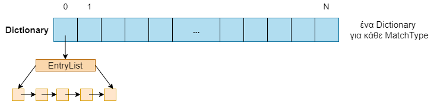
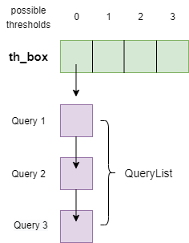

# InvertedSearchEngine
Κ23α Ανάπτυξη Λογισμικού για Πληροφοριακά Συστήματα, Χειμερινό Εξάμηνο 2021 ~ SIGMOD-2013

## Team

- [Δημήτριος Μπέρος - 1115201600269](https://github.com/dberos)
- [Γιώργος Κοκκίνης - 1115201700050](https://github.com/Kokkinis99)
- [Σταύρος Κωστόπουλος - 1115201700068](https://github.com/stavroskostopoulos)

## Project1

### Map
    Είναι η βασική δομή της άσκησης και αναπαριστά ένα κείμενο
    Τα collisions χειρίζονται με separate chaining
    Το κάθε bucket (MapNode) αναπαριστάται από ένα Binary Search Tree
    Κάθε λέξη, αν είναι μοναδική, γίνεται insert στο Bst του bucket της hash position της
    Το max load factor είναι 0,9 και αν μεγαλώσει σε κάποιο insert τότε συμβαίνει rehash
    
    Στην create του Map δημιουργείται η entry list
    Αν κάποια λέξη μπορέσει να μπει στο bucket που κάνει hash τότε δημιουργείται entry
    Το entry αυτό γίνεται insert στην entry list του Map

#### Tests
    cd tests/map
    make
    make run/make valgrind
    make clean

### Binary Search Tree
    Ένα δυαδικό δέντρο αναζήτησης που χρησιμοποιείται στο Map
    Διάταξη με βάση την strcmp και γίνεται είσοδος μοναδικών strings
    Όλες οι λειτουργίες γίνονται αναδρομικά
    Καλείται πάντα μια βοητική bst_node_ συνάρτηση με όρισμα τη ρίζα στην αντίστοιχη bst συνάρτηση
 

#### Tests
    cd tests/bst
    make
    make run/make valgrind
    make clean

### Dictionary
    Δεν χρησιμοποιείται πουθενά και γι'αυτό δεν υπάρχει κάποιο test
    Είναι ένα ακόμα Hash Table
    Κλειδί του κάθε κόμβου είναι ένα αρχικό γράμμα
    Οι μοναδικές λέξεις από αυτό το αρχικό γίνονται insert στη λίστα του hash position

    Αρχική ιδέα ήταν κάθε κόμβος της entry list να είναι ένα bst με όλα τα entries από το ίδιο αρχικό γράμμα
    Με βάση αυτό γινόταν και το deduplication
    Για μεγάλα αρχεία δεν θα ήταν αποδοτικό
    Μπορεί να χρειαστεί σε επόμενη εργασία τροποποιημένο για το payload

### Entries
    Τα entries έχουν υλοποιηθεί όπως ρητά αυτά ζητούνται στην εκφώνηση.
    Πιο συγκεκριμένα, ένα entry_list είναι ένα σύνολο από entries που χαρακτηρίζονται από
    μια κοινή ιδιότητα. Το entry_list όπως αναφέρεται, αποτελεί την είσοδο ενός ευρετηρίου,
    το οποίο θα χτιστεί πάνω στα entries που αντιστοιχούν σε αυτό.

#### Tests
    cd tests/entries
    make
    make run/make valgrind
    make clean
    
    
### Index | BK-tree

    Το ευρετήριο δεδομένων υλοποιήθηκε με την χρήση της δομής BK-tree ακριβώς 
    όπως αυτή περιγράφεται στην εκφώνηση της εργασίας.
    Οι μετρικές του ευρετηρίου είναι το Hamming και Edit distance.
    
#### Tests
    cd tests/bkt | cd tests/words
    make
    make run/make valgrind
    make clean

## Project2

Η βιβλιοθήκη φτιάχνεται τρέχοντας το Make στο lib directory με --silent στο Makefile του /app

Η υλοποίηση μας περνάει όλα τα test και χωρίς leaks, όμως χρειάστηκαν 2 μικρές αλλαγές στο testdriver

~~if(num_res && query_ids) free(query_ids);~~

**Προσθήκη _for(int i=0;i<num_cur_results;i++){free(cur_results[i]);}_ στο τέλος**
    
    cd app
    make
    make run | make valgrind
    make clean

### Map
    Το Map χρησιμοποιείται πλέον μόνο για κάθε Document 
    Δεν έχει αλλάξει κάτι στην υλοποίηση του

### Dictionary 

    Το dictionary είναι το Hash Table για τα entries
    Κάθε bucket αναπαρίσταται από μία entry list
    Το deduplication για τα entries γίνεται στο dictionary
    Αν υπάρχει ήδη η λέξη, απλώς μπαίνει ένα νέο QueryID στο payload του entry

#### Tests
    cd tests/dictionary
    make
    make run/make valgrind
    make clean

### List

    Μια απλή συνδεδεμένη λίστα που χρησιμοποιείται για το payload των entries

#### Tests
    cd tests/list
    make
    make run/make valgrind
    make clean

### QueryMap

    Σε αυτό το σημείο χρειαζόμασταν μια δομή που θα βοηθούσε στο EndQuery
    Ένα Vector δε θα ήταν αποδοτικό σε περίπτωση που έρχονταν QueryIDs σε λάθος σειρά
    Είναι ένα Hash Table που γίνεται hash το QueryID σαν String
    Κάθε bucket αναπαρίσταται από μια QueryList

#### Tests
    cd tests/query_map
    make
    make run/make valgrind
    make clean

### QueryList

    Μια απλή συνδεδεμένη λίστα που χρησιμοποιείται σε κάθε bucket του QueryMap

#### Tests
    cd tests/query_list
    make
    make run/make valgrind
    make clean

### MatchDocument()

#### Διαδικασία
    Η διαδικασία που εκτελείται για την εύρεση των επιτυχόντων queries για κάθε κείμενο είναι η εξής:
    -για κάθε πιθανό threshold TH ( [0,3] )
        -για κάθε Entry e του κάθε πιθανού MatchType x (δηλαδή για κάθε Dictionary)
            -lookup το κατάλληλο-αντίστοιχο ευρετήριο για την λέξη του Entry (e->word)
            -αν το αποτέλεσμα της loοkup δεν είναι κενό
                -βρες τα queries της QueryList του th_box στο κελί για το threshold TH
                 όπου έχουν MatchType==x και ανήκουν στο payload του Entry (e->payload)
                -για τα queries αυτά θέσε την λέξη του Εntry αυτού, ως "matched"
                

